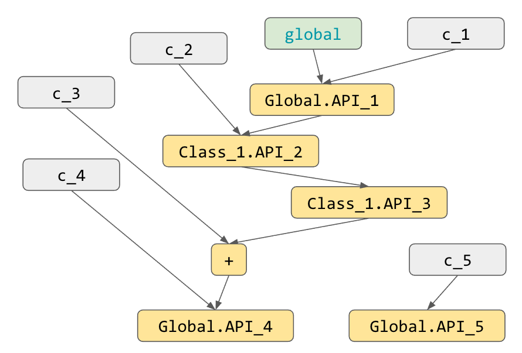
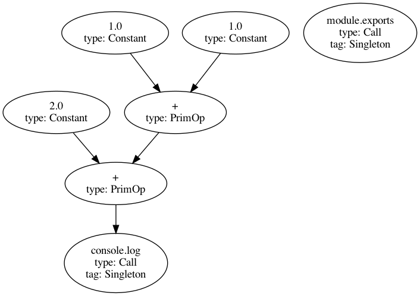
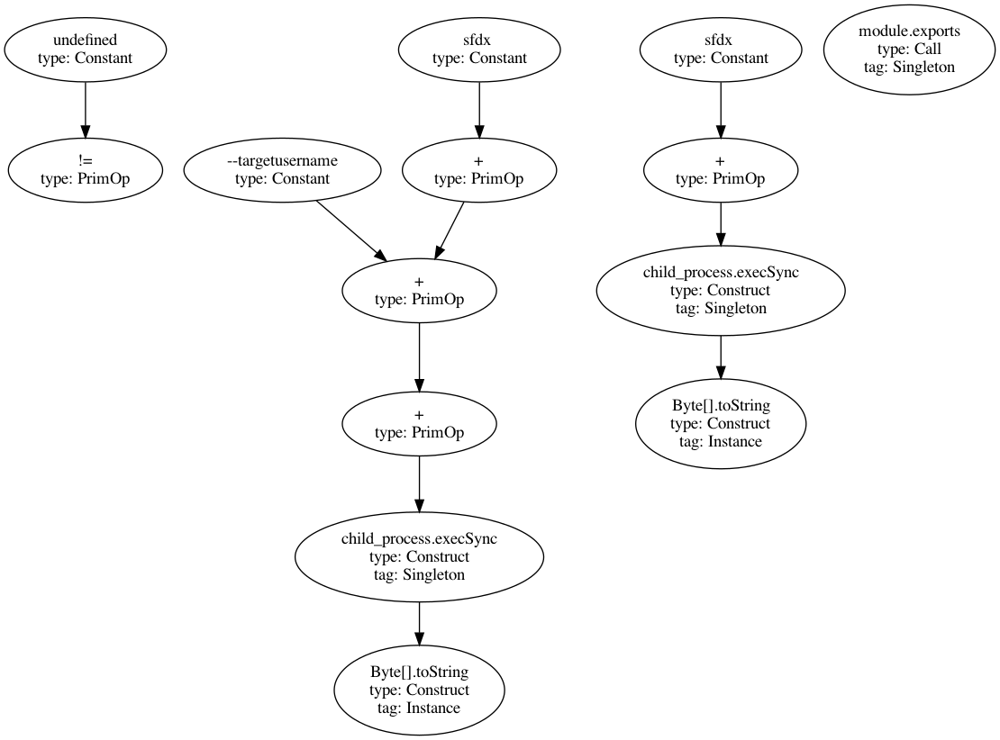
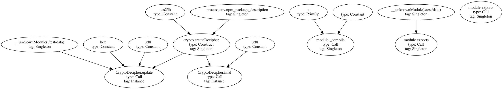
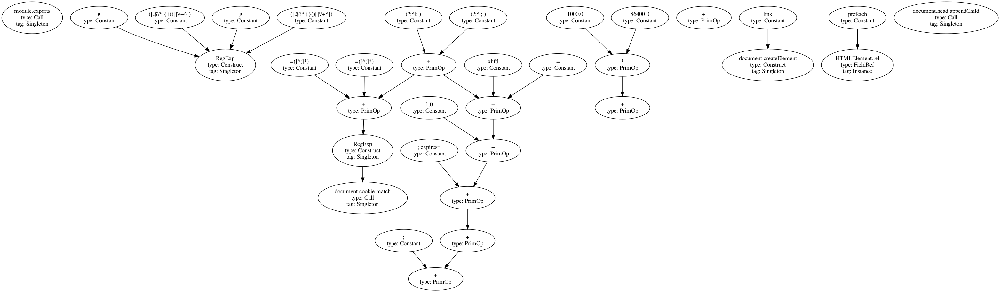
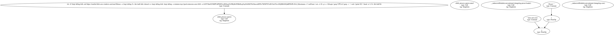
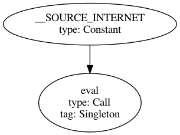

[HTML version](https://dochost.me/github/semantic-graph/js2graph/blob/master/docs/README.md)

## Definition of JS DataFlow Graph

- Node has three attributes:
    - Label: e.g. `console.log`
    - Type: `PrimOp`, `Call`,  `Construct`, `Constant`, `FieldRef`
        - `Call` is for the API invocation that doesn't return anything or return things we probably don't care, i.e. effectively a sink operation
            - e.g. `console.log` doesn't return anything
            - e.g. `http.get` returns a `ClientRequest` which we don't really care...
        - `Construct` is basically for all other types of API invocation -- which can return something interesting (the analyzer can specify the class name of returned value e.g. `Class_1`, or just a wildcard class name `AnyClass`)
    - Tag (optional): `Singleton`,  `Instance`
- Edge has only one attribute with one value
    - Type: `DataFlow`

In current encoding, we also have the convention that:


- “OpNode” is a node with type `PrimOp`/`Call`/`Construct` and a optional tag `Singleton`/`Instance` (indicates the type of base of invocation)
- “ConstNode” is a node with type `Constant`

For edges, contextual/control dependency might be useful in future, but not in current JS case studies. I used to encoding things like `BackgroundTask -> SendSMS` for Android.

## Example of JS DataFlow Graph

Assuming Simplified Signatures:


    API_1: (Global, AnyClass) -> Class_1
    API_2: (Class_1, AnyClass) -> Class_1
    API_3: (Class_1, AnyClass) -> AnyClass
    API_4: (Global, AnyClass, AnyClass) -> AnyClass
    API_5: (Global, AnyClass) -> None

Source code:

    // c_i ..: constants
    // API_i ..: standard APIs
    // x, y, z, v, w: variables
    x = API_1(c_1);
    y = x.API_2(c_2).API_3();
    z = y + c_3;
    w = API_3(c_4, x);
    API_4(c_5);

After explicitly show the `global` environment as an object called `global` and introduce temporary variables for chained invocation:


    x = global.API_1(c_1);
    v = x.API_2(c_2);
    y = v.API_3();
    z = y + c_3;
    w = global.API_4(c_4, z);
    global.API_5(c_5);

The corresponding JS DFG graph:



## Contributions

- A new algorithm and implementation for constructing inter-procedural data-flow graph of JavaScript library/program
    - What is new? The propagated information (domain, transfer function)
- A set of case studies that illustrate the usefulness of this JS DFG representation and the algorithm behind.
    - Optional: contrast it with other potential representations, e.g. call graph

## Case Studies

### Simple data-flow

[Code](src/test/resources/small/example2.js)



### Binary code injection risk

[Code](src/test/resources/small/example3.js)



⚠️ Key nodes:

- `child_process.execSync`: run code from user input

TODO: a "parameter node" is not implemented yet -- we might want to specify in the dependency graph that the analyzed JS is actually a method that can take an unknown parameter which is used in execSync (which is even risker).


### `event-stream`

[Code](src/test/resources/large/eventstream.js)



⚠️ Key nodes:

- `module._compile`: Constructing module programmatically
- `__unknownModule(./test/data)`: unknown module loaded from file system
- `CryptoDecipher.update`: decypting files

### `angular-location-update`

Attacker tries to hide the intention by not using the most common operation for communicating with a server, but by using a rare HTML-based approach

[Code](src/test/resources/large/angular-location-update.js)



⚠️ Key nodes:

- `document.cookie.match`: Read browser's cookie by pattern matching
- `prefetch`: Set up HTML element for communication with a host

### `conventional-changelog-index`

[Code](src/test/resources/large/conventional-changelog-index.js)



⚠️ Key nodes:

- `child_process.spawn`: Spawn a process of dangerous commands

### `eslint-config-build`

[Code](src/test/resources/large/eslint-config-build.js)



⚠️ Key nodes:

- `eval`: [eval](https://developer.mozilla.org/en-US/docs/Web/JavaScript/Reference/Global_Objects/eval) data from `__SOURCE_INTERNET` (a special token in our JS API model)

## Algorithm

### Common definitions

- “API” — API is a subset of methods that invoked on built-in objects or standard library objects.
- “Access Path” — syntax: `x.y.z`

### Current algorithm

Our current algorithm has two main parts: inter-procedural data-flow analysis and graph generation.

Data flow analysis: The abstract domain of each variable is an access path (see below) and transfer function on top of IFDS algorithm. See slides for some example rules.


- **Global API access path**
    - Definition: An access path starting from global built-in or standard library objects
    - A variable $x$ has a global namespace $N$ if
        - $x$ is a built-in object called $N$, e.g. `console`
        - $x$ is an imported standard library object called $N$, e.g. return value of `require(``"``fs``"``)`
        - $x$ is a field access of a variable with global namespace (e.g. `console.log`)
            - If $x = x_0.f_1$ and $x_0$ has namespace $N_0$, then $x$ has namespace $N_0.f_1$
    - Intuitively, global namespace refers to a global object or some object reachable from global ones
    - $x$s that have the same Global API access path refers the same runtime object
- **Instance API access path (AP)**
    - Definition: An access path starting from instances constructed by built-in or standard library class/function objects
    - A variable $x$ has an instance namespace $M$ if
        - $x$ is constructed by an API call in which the receiver $f$ has global namespace $N_f$ that correspond to a return type of $M$
        - $x$ is a field access of a variable with instance namespace
            - If $x = x_0.f_1$ and $x_0$ has namespace $M_0$, then $x$ has namespace $M_0.f_1$
    - Intuitively, instance namespace is the instance’s class which is a global object
    - $x$s that have the same Instance API access path refers different runtime object
- **Constant value**
    - Degenerated form of access path

**Question: Can a field of built-in object be overwritten? What does it imply?**

Yes, it can be over-written which can be tracked inside the abstract domain as well (in theory, not implemented yet) it implies that a field in an API object might not be original

### Graph generation

To generate JS DFG, the algorithm will iterate through each invocation instruction in the reachable methods from entry points. For invocation in the shape of `f(base, a_1, …, a_2)`, the algorithm needs to perform two resolutions for generating related part of the graph:
 
NOTE: **“resolution”** means the process for generating part of the graph from scanned invocation based on the output of DFA, which involves determining label and other attributes of the node as well as what edges to add. There are two main resolution steps to do:
 
- **Downstream node resolution**: For the current invocation, is it an API call? How to represent it?
    - First, the `f` variable must map to a constant string $f$ in the current abstract domain
    - Second, the `base` variable must map to a global namespace $N$ or an instance namespace $M$ in the current abstract domain
    - Concatenating the namespace and $f$ will give us the string representation of this API, which is used as the label of the constructed DFG node
    - The constructed DFG node will be bound to this def site
- **Upstream nodes resolution**: where are the nodes for all the uses of arguments?
    - For a given argument `a_i`
        - If it maps to a constant value → create new constant node
        - If its def site is bound to some existing node → use that existing node
    - These “upstream” nodes will point to the downstream node.

As we can see, the use-def map is used to facilitate the generation of graph, but the major heavy-lifting work is done by the custom DFA.

## Compare with Def-Use Chain Analysis

What if we use use-def information verbatim instead of doing inter-procedural data analysis? Essentially, we need to compute the global or instance namespace on-the-fly by backtracking with the use-def map.

For example:


```javascript
console.log("x");
```

which when represented in instructions, is:

```javascript
v1 = global console; // Read a variable called "console" from the global scope
v2 = v1.log; // Field access
v3 = v2("x"); // invocation
```

For generating JS DFG, it needs to know what does `v2` represents at line 3. To do it with def-use analysis, we need to backtrack from use of “v2” to its definition at line 2, and similarly until line 1, which will eventually tell us it is the field access of a global object, which can be written as `console.log`. As far as I see, this is not computing the closure of use-def chain, but more of reconstructing a particular type of path along the use-def chain.

## Literature Review

### JSAI: a static analysis platform for JavaScript

- Paper: https://sites.cs.ucsb.edu/~benh/research/papers/kashyap14jsai.pdf
- Non official clone: https://github.com/nystrom/jsai

The tool is an “abstract interpreter”. The input is the program, and the output includes (1) type inference (2) pointer analysis (3) CFA (4) string analysis (5) constant propagation.

It doesn’t say that it support inter-procedural/module propagation, or say that it might output that an API depends on another at the data-flow level.

### Practical blended taint analysis for JavaScript

Paper: http://prolangs.cs.vt.edu/refs/docs/weiryder-issta13.pdf

Taint analysis. Not fine-grained DFG.

### Type Analysis for JavaScript

Focus on type analysis. No DFG.

### JStap: a static pre-filter for malicious JavaScript detection

https://swag.cispa.saarland/papers/fass2019jstap.pdf

DDG → rather than DFG.

### Mining interprocedural, data-oriented usage patterns in JavaScript web applications

https://citeseerx.ist.psu.edu/viewdoc/download?doi=10.1.1.965.9873&rep=rep1&type=pdf

The example (figure 4) contains many nodes that are not part of the representation that we want (like variables, assignment, and control edges). No available artifact or description of the algorithm (no keyword like propagation, framework etc.).

## CodeQL

https://help.semmle.com/QL/learn-ql/javascript/dataflow.html

NOTE: it has some technical limitations, such as less control over what code is analyzed and what is not.

## Closure Compiler

Only intra-procedural analysis.

### Misc

1. R.-Y. Chang, A. Podgurski, and J. Yang, “Discovering neglected conditions in software by mining dependence graphs”,IEEE Trans. Softw. Eng., vol. 34, no. 5, pp.579–596, 2008
2. A. Wasylkowski, A. Zeller, and C. Lindig, “Detecting object usage anomalies”,Proceedings of the 6th joint meeting of the European software engineering conference and the ACM SIGSOFT symposium on the foundations of software engineering, ESEC/FSE’07
